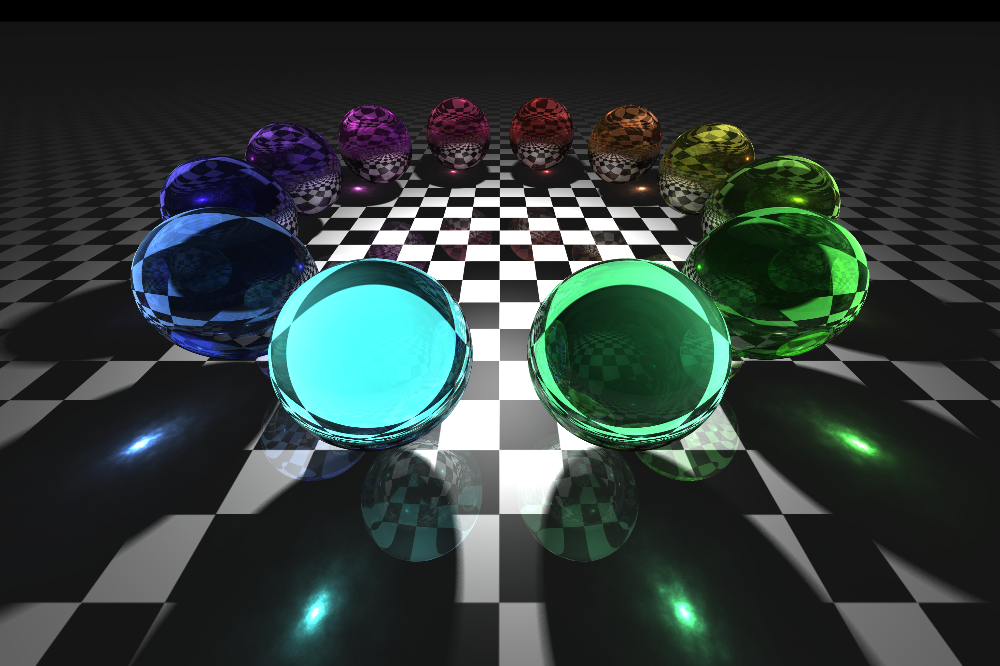
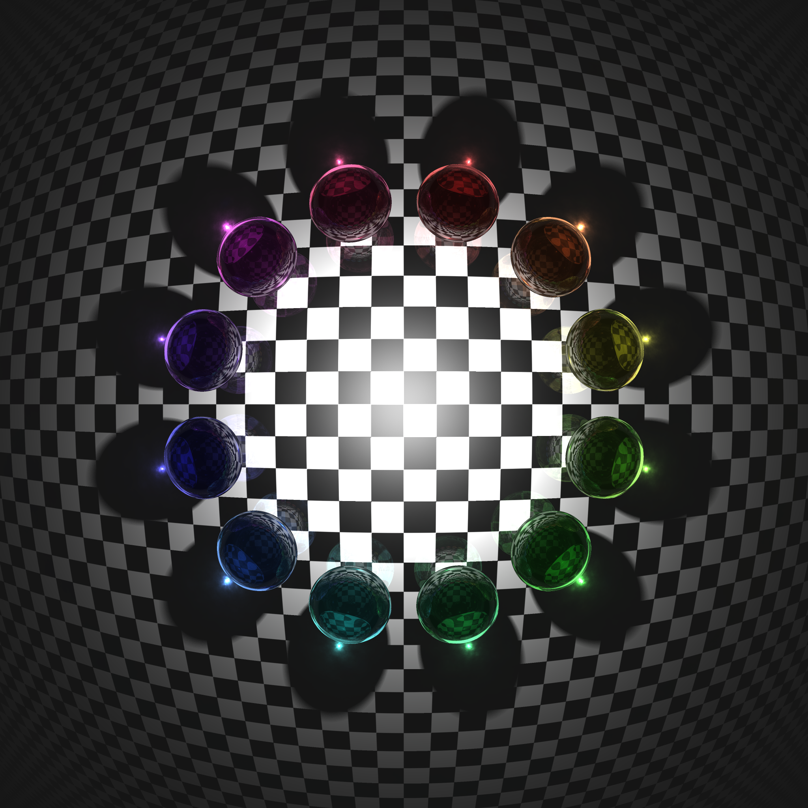
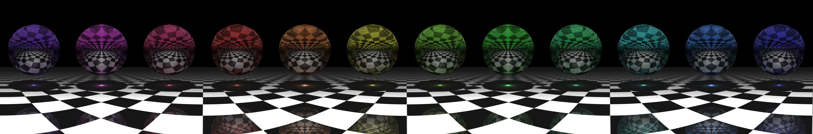
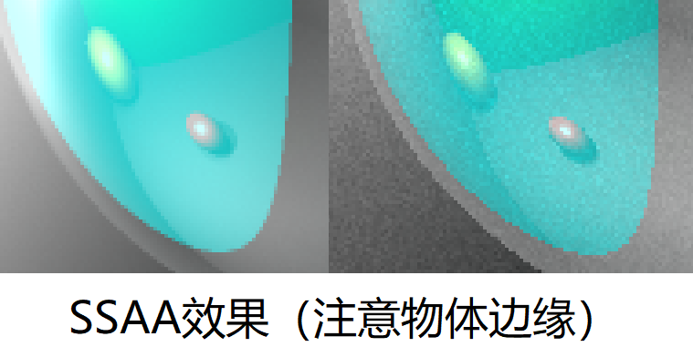
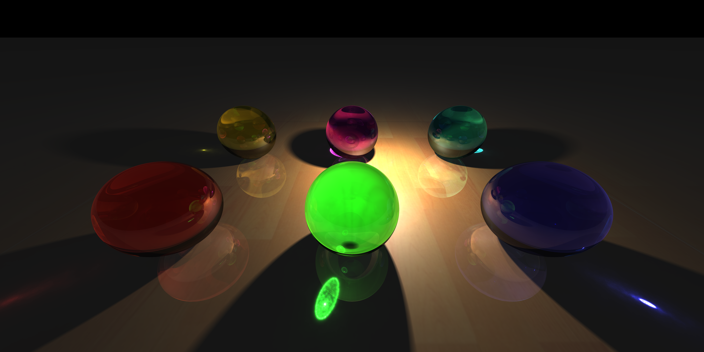
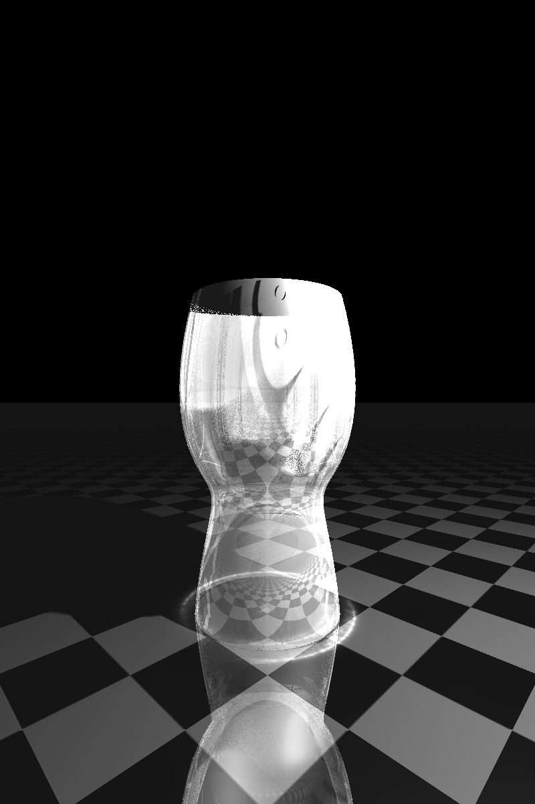

# 三维造型与渲染


## 一、算法选型

**光线追踪(Ray Tracing) + 光子映射(Photon Mapping)**

光线追踪能够很好的实现光的漫反射、阴影、镜面反射、折射等效果，但难以追踪光线经折射形成焦散(Caustics)效果，而光子映射则可很好的实现它。但光子映射需要储存大量的光子，在光子较少时，渲染出的图像容易产生低频噪声。故结合以上两者，首先使用光子映射构建photonmap，供光线追踪时的漫反射计算时叠加使用。

**代码片段**

[raytracer.h](raytracer.h)

```c++
class RayTracer {
    unsigned max_dep;           //最大追踪深度
    unsigned light_quality;     //软阴影质量：点光源采样次数/面光源单位面积采样次数
    double ambient;             //环境光系数
    Photonmap *photonmap;       //光子图（由PhotonTracer得到）

    Color trcDiff(HitInfo* info, Scene* scene, double ambient);         //追踪漫反射光
    Color trcRfle(HitInfo* info, Scene* scene, int dep, double decay);  //追踪反射光
    Color trcRfra(HitInfo* info, Scene* scene, int dep, double decay);  //追踪折射光
    Color Trace(const Ray& ray, Scene* scene, int dep, double decay);   //追踪光线ray

public:
    RayTracer();
    ~RayTracer();

    void setMaxDepth(unsigned dep) { max_dep = dep; }
    void setLightQuality(unsigned quality) { light_quality = quality; }
    void setAmbient(double _ambient) { ambient = _ambient; }

    Film* Run(Scene *scene, Sampler *sampler);      //主循环
};

```

---

[photontracer.h](photontracer.h)

```C++
class Photontracer {
	Scene* scene;
	Photonmap* photonmap;

	void PhotonTracing( Photon , int dep );			//追踪光子
	bool PhotonDiffusion( HitInfo* , Photon , int dep , double* prob );	//光子漫反射
	bool PhotonReflection( HitInfo* , Photon , int dep , double* prob );//光子反射
	bool PhotonRefraction( HitInfo* , Photon , int dep , double* prob );//光子折射

public:
	void SetScene( Scene* input ) { scene = input; }
	Photonmap* GetPhotonmap() { return photonmap; }
	void Run();
};

```


**效果展示**



[img_colorful.png](pic_example/img_colorful.png)


## 二、附加功能

### 1. 鱼眼镜头效果与广角镜头效果



[img_fish.png](pic_example/img_fish.png)


[img_fish0.png](pic_example/img_fish0.png)



[img_wide.png](pic_example/img_wide.png) *（相机位于原点，360度拍摄）*

具体来说，将[camera类](camera.h)与[sampler类](sampler.h)分离开，通过sampler的派生类实现不同的镜头效果。

[sampler.h](sampler.h)

```c++
Vector3 FishEyeSampler::point(int i, int j, int ss_i, int ss_j) const override {
    double u, v;
    if(n_SS > 1) {
        u = w * (2 * j + ((double)(2 * ss_j + 1) / w_SS)) / w_pix - w;
        v = -h * (2 * i + ((double)(2 * ss_i + 1) / h_SS)) / h_pix + h;
    }
    else {
        u = ((double)(2 * j + 1) / w_pix - 1.0) * w;
        v = (1.0 - (double)(2 * i - 1) / h_pix) * h;
    }

    return Vector3(
        u,
        v,
        sqrt(1 - u * u - v * v)
    );
}
    
Vector3 WideAngleSampler::point(int i, int j, int ss_i, int ss_j) const override {
    double u, v;
    if(n_SS > 1) {
        u = w * (2 * j + ((double)(2 * ss_j + 1) / w_SS)) / w_pix - w;
        v = -h * (2 * i + ((double)(2 * ss_i + 1) / h_SS)) / h_pix + h;
    }
    else {
        u = ((double)(2 * j + 1) / w_pix - 1.0) * w;
        v = (1.0 - (double)(2 * i - 1) / h_pix) * h;
    }

    double phi = sqrt(u * u + v * v);

    return Vector3(
        cos(v) * sin(u),
        sin(v),
        cos(v) * cos(u)
    );
}
```


### 2. 超采样抗锯齿(SSAA)

[sampler类](sampler.h)同时支持SSAA（效率有所牺牲）（代码见上）



### 3. 软阴影

[AreaLight类](light.h)分块采样，[PointLight类](light.h)通过抖动实现软阴影效果。下图为具有4个面光源的场景，注意软阴影效果（上述所有展示图中均有软阴影，本场景的效果更为明显）。


[img6.png](pic_example/img_6.png)

**代码片段**

[light.h](light.h)

```c++
Color AreaLight::GetIrd(HitInfo * info, Scene * scene, unsigned quality) {
    int qualt_x_aera = quality * area;
    if(qualt_x_aera < 1) qualt_x_aera = 1;
    Color result = Color::black();

    for(int i = -2; i < 2; ++i) for(int j = -2; j < 2; ++j)
        for(int k = qualt_x_aera; k > 0; --k) {
            Vector3 S((rand(i, i + 1)) / 2, (rand(j, j + 1)) / 2, 0.0);
            result = raw_sum(result, CaQIrd(M * S, info, scene));
        }
    result = result / (qualt_x_aera * 16);

    return result;
}

Color PointLight::GetIrd(HitInfo* info, Scene* scene, unsigned quality) {
    Color result = Color::black();
    quality <<= 4;
    for(int i = quality; i > 0; --i) {
        Vector3 S = O + Vector3::rand_unity() * jiggle;		//抖动软阴影
        result = raw_sum(result, CaQIrd(S, info, scene));
    }
    result = result / (quality);
    return result;
}

```


### 4. 纹理贴图

上述展示图中的棋盘格为图片纹理，可更换为别的纹理图片。下图将纹理更换为木纹：



[img_wood.png](pic_example/img_wood.png)

**代码片段**

```c++
class Texture {
public:
    int w_pix, h_pix;
    std::vector<Color> map;
    Color at(double u, double v) {
        u *= h_pix, v *= w_pix;
        int i = (int)u, j = (int)v;
        u -= i, v -= j;
        if(w_pix * i + j + w_pix + 1 < w_pix * h_pix)
            return 0.25 * 
                (map[w_pix * i + j] * (1-u) * (1-v) + 
                map[w_pix * i + j + 1] * (1-u) * v +
                map[w_pix * i + j + w_pix] * u * (1-v) +
                map[w_pix * i + j + w_pix + 1] * u * v);
        else return 0.25 * map[w_pix * i + j];
    }
};
```


### 5. 参数曲面

实现了Bezier曲线回转体的求交，但迭代时容易出现收敛到错解的情况，导致噪点出现，故未在最终展示图中添加。下图为一个单独的参数曲面（材质具有一定透明度、镜面反射率）：



可以看到，仍有一些噪点存在。迭代过程如下：

[primitive.h](primitive.h)

```C++
////牛顿法迭代 《计算机图形学基础教程(第2版)》P107
int newton_cnt = 0;
do {
    dC_dt = d_,
    dS_du = dS_dt(u, v),
    dS_dv = dS_dtheta(u, v);
    f = (e_ + t0 * d_ - S(u, v));
    double D = mix(dC_dt, dS_du, dS_dv);

    if(fabs(D) < EPS) {
        t0 += rand(-0.02, 0.02), u += rand(-0.02, 0.02), v += rand(-0.02, 0.02);
        --newton_cnt; dt = 1;
        continue;
    }

    dt = -mix(dS_du, dS_dv, f) / D;
    du = -mix(dC_dt, dS_dv, f) / D;
    dv = mix(dC_dt, dS_du, f) / D;
    t0 += dt * newton_leap, u += du * newton_leap, v += dv * newton_leap;

    if(u < EPS || u - 1.0 > -EPS) u = rand(0, 1), newton_cnt -= 1;

} while(f.length() > 0.001 && ++newton_cnt < 10);

if(f.length() < 0.002 && t0 >= EPS) 
    break;  //ok
}  
if(f.length() >= 0.002 || t0 < EPS) return false;

```


## 附

编译环境：Visual Studio 2017 + OpenCV-3.4.1-vc14_vc15

编译选项：Release x64